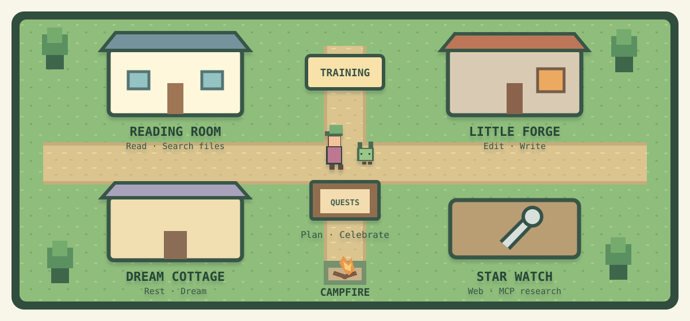

# Claude Pixel Village

A local pixel village for Claude Code. Your sessions become adventurers; subagents become companions. They visit the reading room, forge, star watch, and training yard as work happens. The full animated village lives in your browser, and the Claude Code mod connects it automatically without adding settings hooks.



## Start the village

Requires Node.js 22.12+ (Node 24 recommended) and a local Claude Code session. The same source runs on Windows, macOS, and Linux; install dependencies separately on each machine.

```sh
git clone https://github.com/Sergb39/ClaudePixelVillage.git
cd ClaudePixelVillage
npm ci
npm run dev
```

Open [http://127.0.0.1:4317](http://127.0.0.1:4317). The browser starts with demo residents, so you can play a village day before connecting Claude. The receiver status in the top bar means the local server is reachable. **Claude events flowing** means a real event arrived recently.

For a built client, run `npm run build` and then `npm start`. Keep only one server on port 4317. State and event metadata stay on this computer.

## Connect Claude Code once

The [Claude Code mod](https://code.claude.com/docs/en/plugins/mods/overview) observes local events and adds `/village` for connection status. It requires terminal Claude Code 2.1.287+ or Desktop Code 2.1.286+ in a local Code session. A cloud session cannot reach the local receiver.

1. In this repository, run `npm run mod:prepare`. It prints an absolute marketplace path for this computer.
2. Keep `npm run dev` (or `npm start`) running, then use these commands in Claude Code, replacing the path with the one printed above:

   ```text
   /plugin marketplace add /absolute/path/to/ClaudePixelVillage/config/mod-marketplace
   /plugin install pixel-village@pixel-village-local
   /reload-plugins
   ```

   Choose **User** scope if asked. A fresh local Claude session also loads the mod.
3. Run `/village`, then submit a prompt that uses a tool. A real resident should appear in the browser. The connection guide disappears after an event arrives.

The mod sends only event names, session/agent IDs, tool names, tool-use IDs, and notification types. It never forwards prompts, code, tool inputs or outputs, file paths, or transcripts. If the village is unavailable, Claude continues working. The generated marketplace contains the token-file **path**, never the token. After moving this repository, run `npm run mod:prepare` again, add the new marketplace path, and reinstall the plugin.

If you used an older version with settings hooks, verify the mod first, then remove this checkout's old hooks with `npm run hooks:uninstall -- --global`. For project-local settings, use `npm run hooks:uninstall -- --settings /absolute/path/to/.claude/settings.local.json`. The command backs up the settings file and preserves unrelated hooks. The former hook installer and bridge are retired.

For mod development, `claude --plugin-dir ./mod` loads source directly for one session. Normal installation uses the generated marketplace so Claude's plugin cache retains the correct token path.

## The village

| Claude activity | Village behavior |
| --- | --- |
| Session start or resume | Stable adventurer arrives or wakes |
| Prompt or task | Moves to the quest board |
| Read / search files | Reads at the library |
| Edit / write | Works at the forge |
| Web / MCP research | Looks through the telescope |
| Shell / tests | Trains in the yard |
| Permission or question | Waits with a question bubble and enters the attention list |
| Subagent | Smaller companion joins, then returns after finishing |
| Stop | Rests at the campfire, then sleeps |
| SessionEnd | Adventurer and companions depart |

Search residents by name, session ID, or tool. Select one for its active tools, last observed event, and a 12-event timeline. Give it a nickname or choose a hat/companion shape; these changes are saved in your browser. Night mode and gentle sounds are optional and saved there too. Every three observed `TaskCompleted` events add a decorative banner. Demo events count as demo progress and have no effect on Claude.

A status becomes **No recent event** after five minutes without an event while a resident appears active. This flags uncertainty: it does not claim the tool failed or the session ended. A new event clears the flag. The attention list also shows permission waits and interrupted work. Work may be parallel; each tool remains listed until its own completion event arrives.

Animations are interpretations of hook metadata, not observations of Claude's private reasoning. The timeline keeps the last 300 sanitized events for the whole village, so older entries disappear. The actor's tool and permission state is independent of that display history. Standard events do not provide a reliable nested parent tree, so companions belong to their session adventurer.

## Local data and security

The server binds only to `127.0.0.1:4317`. `.village/snapshot.json` stores current residents, completed quest count, and the last 300 sanitized events. `.village/token` authenticates mod delivery. Both are ignored by Git. Browser writes require the local origin and an HttpOnly SameSite cookie. The token is never served to the browser or committed.

- `GET /api/health`: receiver status
- `GET /api/state`: sanitized snapshot
- `GET /api/stream`: SSE snapshots and heartbeat
- `POST /api/events`: normalized event metadata
- `POST /api/reset`: clear demo residents/events while preserving real sessions

Up to 100 actors and 500 closed identities are retained. Session sequence is assigned on receipt, so simultaneous source events can appear in a different order. Refresh restores resident status; characters route from the gate to their current station.

## Develop and test

```sh
npm ci
npm test
npm run build
npm run mod:prepare
```

Tests cover lifecycle, parallel and reordered tools, high-volume history eviction, stale activity, persistence, local authentication, path protection, navigation, mod packaging, queue/retry behavior, and legacy migration. For a native Claude validator check, run `claude plugin validate ./mod` and `claude plugin test ./mod` with a supported Claude Code version. A successful validator is separate from a real event-delivery check; use `/village` and a fresh local session for that.

`npm run demo:replay` replays the sample story. `npm run demo:replay -- path/to/snapshot.json` replays a sanitized journal under new `demo-replay-*` IDs. Clear demo residents from the browser afterward.

The client uses Phaser, TypeScript, and Vite; the local receiver uses Node HTTP and SSE. Character and scenery art are original pixel templates in code. See [the design and architecture guide](PLAN.md) and [art provenance](assets/PROVENANCE.md). This is an independent project, not an official Anthropic or Nintendo product.
